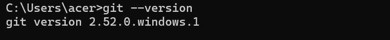
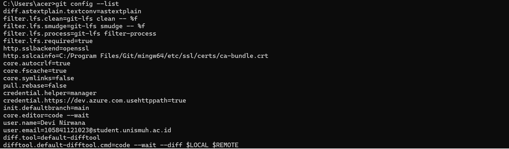
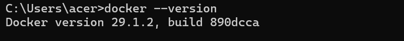
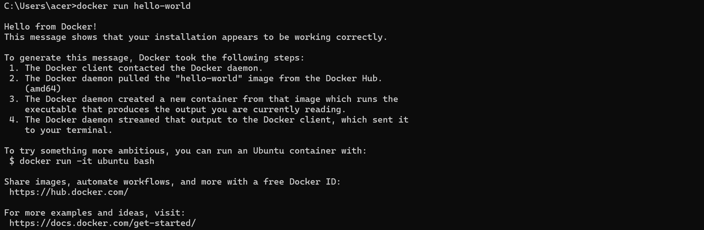
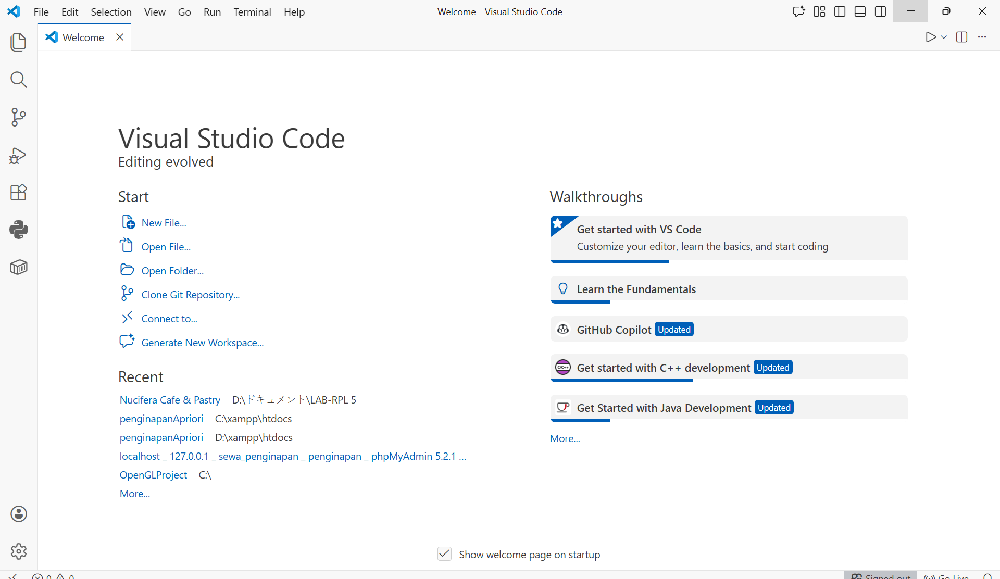
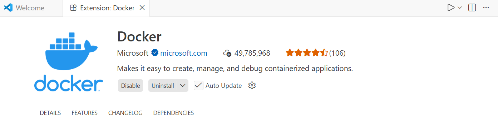
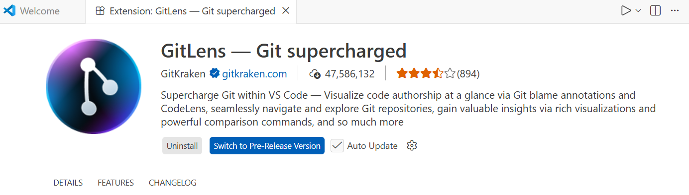
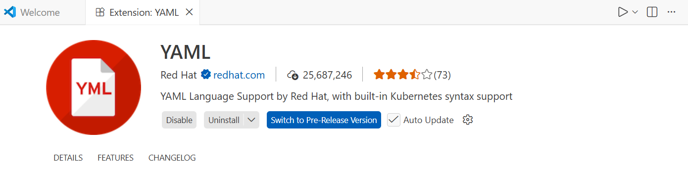
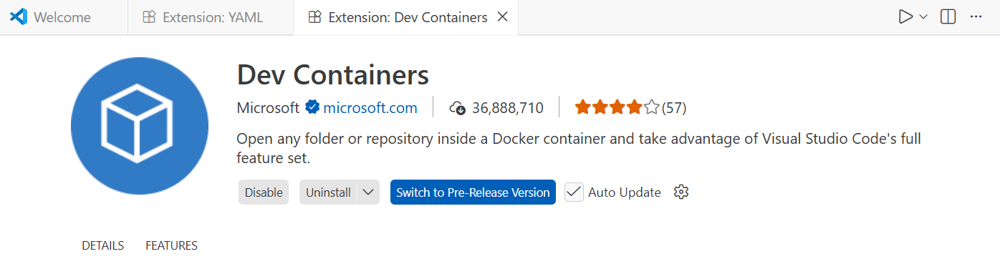

Nama : Devi Nirwana
Nim : 105841121023

Program Studi Informatika - Fakultas Teknik - Universitas Muhammadiyah Makassar
Praktikum DevOps ci cd

Tugas Praktikum!
1.	Pemahaman DevOps
    a)	Penjelasan DevOps
	    DevOps adalah cara kerja supaya membuat dan menjalankan aplikasi jadi lebih mudah, cepat, dan tidak sering rusak. DevOps menggabungkan dua orang penting dalam dunia IT, yaitu Developer dan Operations.
	    Developer adalah orang yang membuat program atau aplikasi. Mereka menulis kode supaya aplikasi bisa berjalan. Operations adalah orang yang menjaga aplikasi tetap hidup di server supaya bisa dipakai banyak orang setiap hari.
        Kalau dua tim ini tidak bekerja sama, biasanya bisa terjadi masalah. 	Misalnya aplikasi error saat dipasang di server, atau tiba-tiba tidak bisa dibuka. Ini bisa membuat pengguna kecewa.
        Dengan DevOps, Developer dan Operations bekerja bersama dari awal. Mereka tidak jalan sendiri-sendiri. Mereka saling membantu supaya aplikasi bisa berjalan dengan baik.
	    Mereka juga memakai alat bantu seperti Git untuk menyimpan dan mengatur kode, supaya tidak hilang atau tertukar. Lalu ada Docker supaya aplikasi bisa berjalan sama di semua komputer tanpa beda-beda.
	    Jadi, DevOps membuat proses dari menulis kode sampai aplikasi dipakai orang jadi lebih cepat, lebih aman, dan lebih teratur.
    b)	Mengapa DevOps Penting?
        Sekarang hampir semua bisnis punya aplikasi atau website. Orang-orang ingin aplikasi yang cepat dan tidak error. Kalau aplikasi sering rusak atau lama, orang bisa marah dan pindah ke tempat lain.
        DevOps penting karena membantu perusahaan memperbarui aplikasi dengan cepat tanpa merusaknya. DevOps juga membantu mengurangi kesalahan saat meng-upload aplikasi ke server. Tim jadi lebih kompak karena bekerja bersama. Risiko aplikasi down juga jadi lebih kecil.
        Dengan DevOps, kalau ada bug atau fitur baru, bisa langsung diperbaiki dan diuji tanpa membuat aplikasi mati lama.
    c)	contoh perusahaan yang sukses menerapkan DevOps
	    Contoh perusahaan di sekitar kita adalah Gojek, Tokopedia, dan Shopee. Misalnya di Gojek. Kalau mereka ingin menambah promo atau fitur baru, mereka tidak bisa mematikan aplikasi terlalu lama karena banyak orang memakainya setiap hari. Dengan DevOps, perubahan kode bisa langsung dicek dan dijalankan otomatis. Kalau ada error, bisa cepat diperbaiki. Bahkan bisnis online kecil juga bisa memakai DevOps supaya websitenya tetap lancar dan tidak sering bermasalah.
2.	Screenshot Bukti Instalasi
    a)	Output git --version dan git config --list
        
        
    b)	Output docker --version dan docker run hello-world
        
        
    c)	Tampilan VS Code dengan extensions yang terinstall
        
        
        
        
        
 
 
 
 
 
